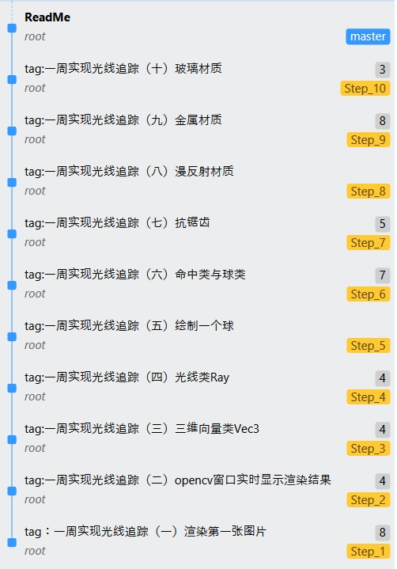

# 一周实现光线追踪

作者（B站UP主，感谢三连！！！）：FaithBook-_-
GitHub：FaithBook233
技术交流群（非粉丝群）：815093873

《opencv.rar》包含此项目必要的opencv库文件等,直接将文件解压到当前文件夹,然后在电脑的系统变量的Path中添加opencv\build\vc15\bin的绝对路径即可使用
git的提交记录中有专栏中对应的步骤代码，直接checkout某一次提交可直接使用

过程请参考B站专栏文集
https://www.bilibili.com/read/readlist/rl355867?spm_id_from=333.999.0.0

运行环境：Windows 10 Visual Studio 2019
代码参考《Ray Tracing in One Weekend》
文献中并未提及运行环境等信息，我见到有人用Visual Studio Code实现了，但我更热衷于用VS，所以决定用Visual Studio实现代码
原文为单精度浮点，我整体改为双精度浮点了

运行此项目必须的步骤：
1. 准备Visual Studio 2019或更高的版本，低版本可能有兼容问题
2. （已实现）在项目属性->调试->命令参数中输入 >Image.ppm  可以将控制台程序输出到Image.ppm
3. 用ppm viewer打开Image.ppm即可看到效果

本项目是我学习C++与渲染算法的一个小Demo，代码开源供广大网友学习
有问题尽量自己解决，知识不够先问度娘，加油少年！

参考文献《Ray Tracing in One Weekend》 Peter Shirley Version 1.54 Copyright 2018. Peter Shirley. All rights reserved
